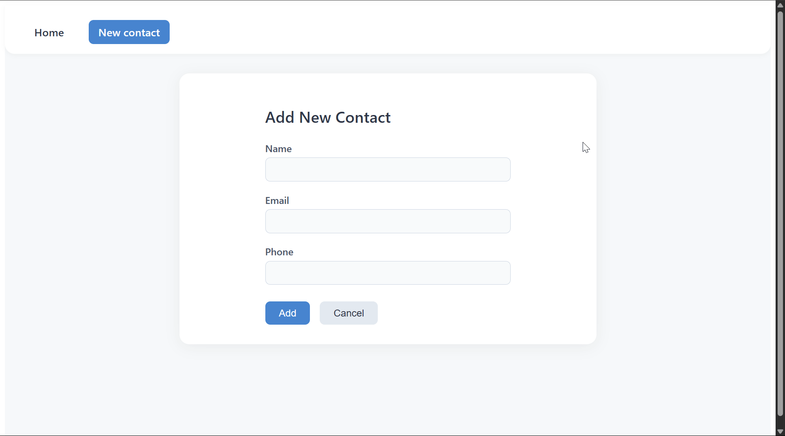
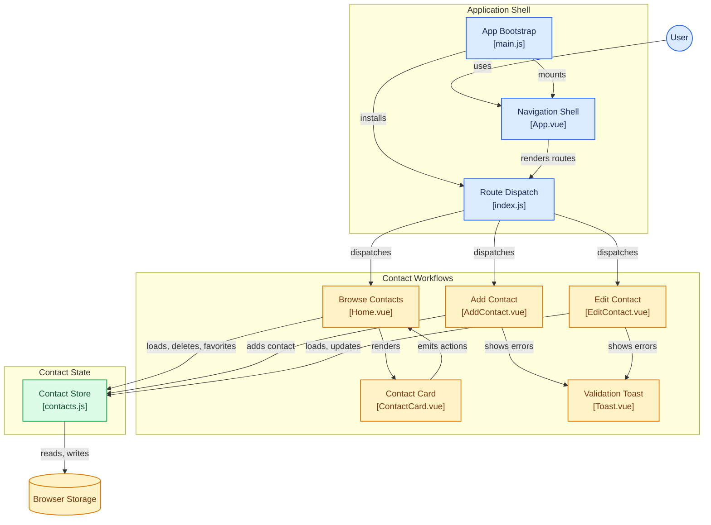

## 🗂️ Contact Manager

A small Vue 3 app to manage contacts (CRUD).
Built with Vite + Vue Router + Pinia + `<script setup>` syntax.

## Demo



### Getting Started

---

```bash
npm create vite@latest contact-manager -- --template vue
cd contact-manager
npm install
npm run dev
```

The app runs at:

```
Local: http://localhost:5173/
```

### Features

---

* Vue 3 with `<script setup>`
* Component-based structure
* Vue Router (navigate between Home / Add / Edit)
* Pinia store (for contact data + localStorage)
* CRUD functionality:
  * View contacts
  * Add contacts
  * Edit contacts
  * Delete contacts

### Vue Concepts Covered

---

| Concept            | Used in                      |
| ------------------ | ---------------------------- |
| `<script setup>`   | All components               |
| Props / Emits      | `ContactCard.vue`            |
| Vue Router         | `router/index.js`            |
| Pinia (state mgmt) | `store/contacts.js`          |
| LocalStorage       | Data persistence             |
| Dynamic routes     | Edit-contact page            |
| Computed / v-model | Forms and filtering          |

### Project Structure

---

```bash
src/
├─ components/
│  ├─ ContactCard.vue
│  ├─ ContactForm.vue
│
├─ views/
│  ├─ Home.vue
│  ├─ AddContact.vue
│  ├─ EditContact.vue
│
├─ store/
│  └─ contacts.js
├─ router/
│  └─ index.js
├─ App.vue
├─ main.js
```

### 🌲 Architecture Diagram



### Links

---

* [Vue 3 `<script setup>` Docs](https://vuejs.org/api/sfc-script-setup.html)
* [Vue Scaling Up: Tooling & IDE support](https://vuejs.org/guide/scaling-up/tooling.html#ide-support)
* [Pinia – Vue's official state management](https://pinia.vuejs.org/)
